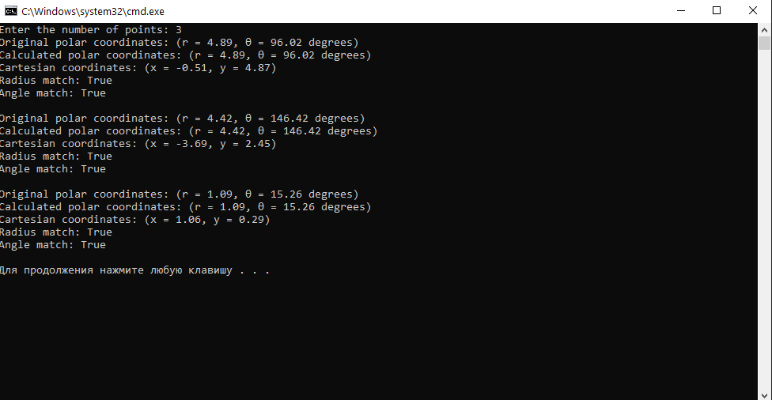
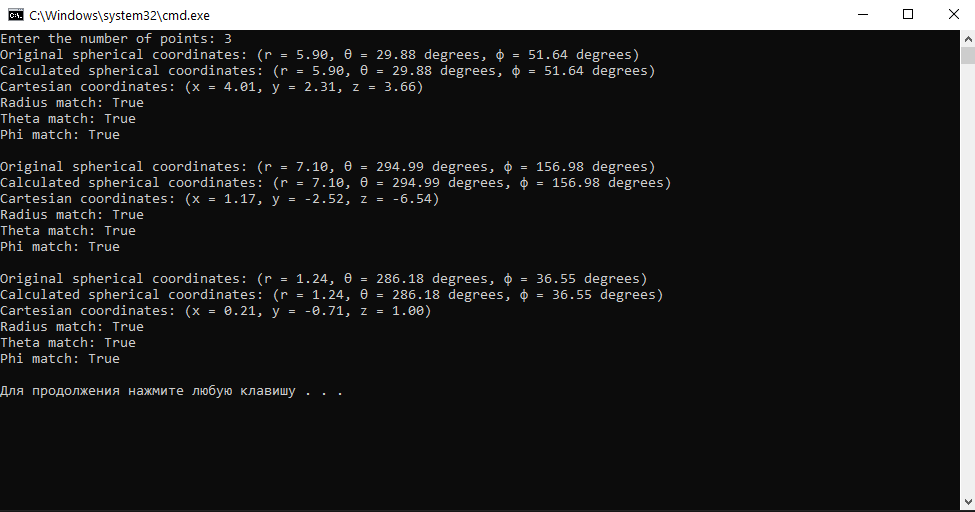
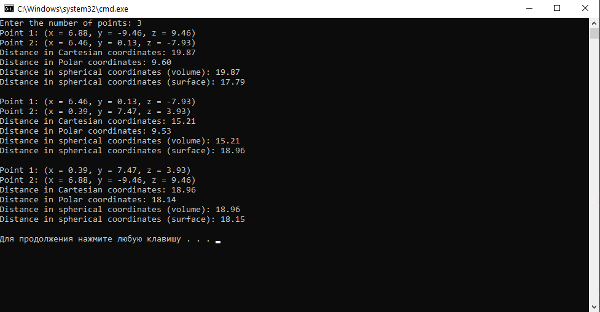
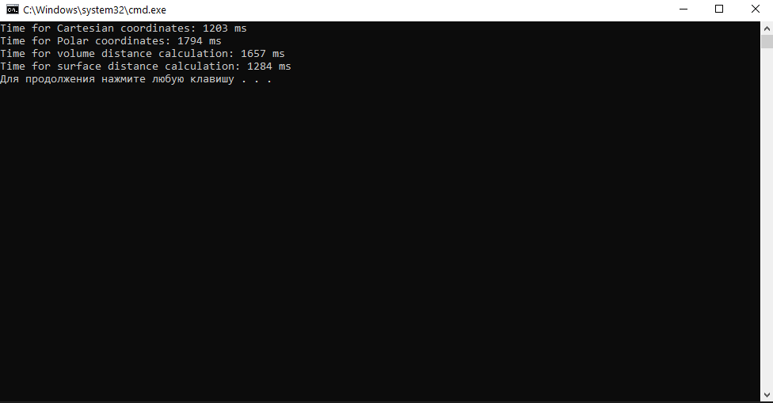
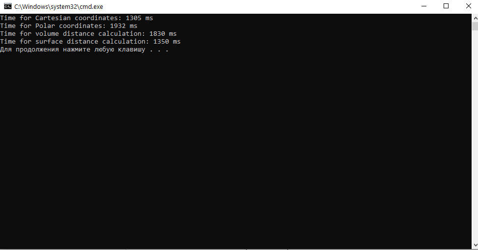
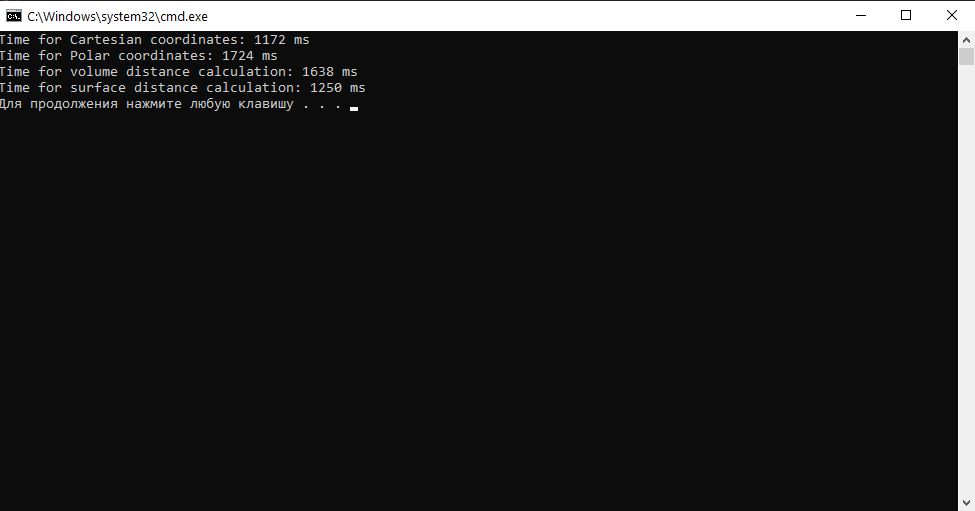

<h2> Перехід між системами координат </h2>

<strong>1.1 Двовимірний простір: Декартова та полярна системи координат </strong>
- Задати координати декількох точок у полярній системі координат.
- Перевести ці координати в декартову систему координат.
- Здійснити зворотний перехід з декартової системи координат в полярну.
- Перевірити коректність розрахунків, упевнившись, що вихідні координати співпадають з отриманими після зворотного перетворення.

Для того, щоб перевести з одної системи координат у іншу, використовують формулу 
з полярної в декартову:

x = r * cos(ϴ)

y = r * sin(ϴ)

з декартової в полярну:

r = √(x^2 + y^2)

ϴ = arctan(y/x)

  

    Результат задачі 1.1 

   

<strong>1.2. Тривимірний простір: Декартова та сферична системи координат </strong>

- Задати координати декількох точок у сферичній системі координат.
- Перевести ці координати в декартову систему координат.
- Здійснити зворотний перехід з декартової системи координат в сферичну.
- Перевірити коректність розрахунків, упевнившись, що вихідні координати співпадають з отриманими після зворотного перетворення.

Для того, щоб переходити у тривимірному просторі переходити між декартовою та полярною системами координат, використовують наступні формули:
зі сферичної в декартову:

x = r * sin(ф) * cos(ϴ)

y = r * sin(ф) * sin(ϴ)

z = r * cos(ф)

з декартової в сферичну

r = √(x^2 + y^2 + z^2)

ϴ = arctan(y/x)

ф = arctan(z/r)

  

    Результат задачі 1.2

   

<strong>2. Розрахунок відстаней у сферичній системі координат </strong>

- Виконати обчислення відстані між точками у сферичній системі координат двома способами:
- Декартова система координат: Використати стандартну формулу для обчислення прямої відстані у двовимірному та тривимірному просторі.
- Полярна система координат: Використати формулу для обчислення відстані між точками у двовимірному просторі.
- Сферична система координат: Виконати обчислення відстані між точками двома способами:
- Через об'єм сфери: використати формулу для прямої відстані у тривимірному просторі.
- По поверхні сфери: використати формулу для великої колової відстані.

Для розрахунку прямої відстані між двома точками у декартовій системі координат використовують наступні формули:
двовимірний простір: 

 d = √((x2 - x1)2 + 
       (y2 - y1)2)

тривимірний простір: 

  d = √((x2 - x1)2 +
       (y2 - y1)2 +
       (z2 - z1)2)

Для прямої відстані між двома точками у полярній системі координат використовують формулу: 

  d = √(r12 + r22 - 
       2 × r1 × r2 × cos(θ2 - θ1))

Для прямої відстанї між двома точками у сферичній системі координат (через об'єм сфери) використовують формулу: 

 d = √(r12 + r22 - 
       2 × r1 × r2 × (sin(θ1) × sin(θ2) × cos(φ1 - φ2) + 
       cos(θ1) × cos(θ2)))

Для дугової відстані між двома точками на поверхні сфери (велика колова відстань) використовують формулу:

  d = r × arccos(sin(φ1) × sin(φ2) + 
                 cos(φ1) × cos(φ2) × cos(θ1 - θ2))

  

    Результат задачі 2

   

<strong>3. Бенчмарки продуктивності </strong>

- Згенерувати масив координат пар точок у кожній системі координат (декартова, полярна, сферична).
- Виконати розрахунок відстаней між цими точками для кожної системи координат.
- Виміряти тривалість обчислень для кожної системи координат.
- Обрати такий розмір масиву, за якого результат бенчмаркінгу матиме незначну варіативність від запуску до запуску (рекомендовано розмір масиву 10000 - 100000 точок).

Оскільки код на Python не підтримує кількість точок більшу за 1000 через обмеження пам'яті й обчислення всіх попарних відстаней потребує значного обсягу оперативної пам'яті для збереження великої матриці відстаней, то мною було обрано кількістью точок рівну 1000. Наступний код генерує 1000 випадкових тривимірних точок у декартових координатах та перетворює їх у полярні та сферичні координати. Потім він обчислює відстані між точками в декартовій, полярній та сферичній системах координат, використовуючи різні методи (за об'ємом сфери та по її поверхні). Час, витрачений на розрахунки відстаней для кожної системи координат, вимірюється та виводиться на екран.

  

  

  

    Результати задачі 3 з різним часов виконання 

На скріншотах видно, скільки часу знадобилося на обчислення відстаней між 1000 пікселів у різних системах координат. У Декартовій системі координат обчислення зайняли в середньому приблизно 1230 мс, а Полярній — 1820 мс. Це показує, що розрахунки у Полярній системі вимагають більше часу через перетворення координат.

З цього можна зробити висновок, що розрахунки в сферичній системі координат за поверхнею простіші для обчислення, оскільки вони займають менше часу і вимагають менше обчислювальних ресурсів комп'ютера.